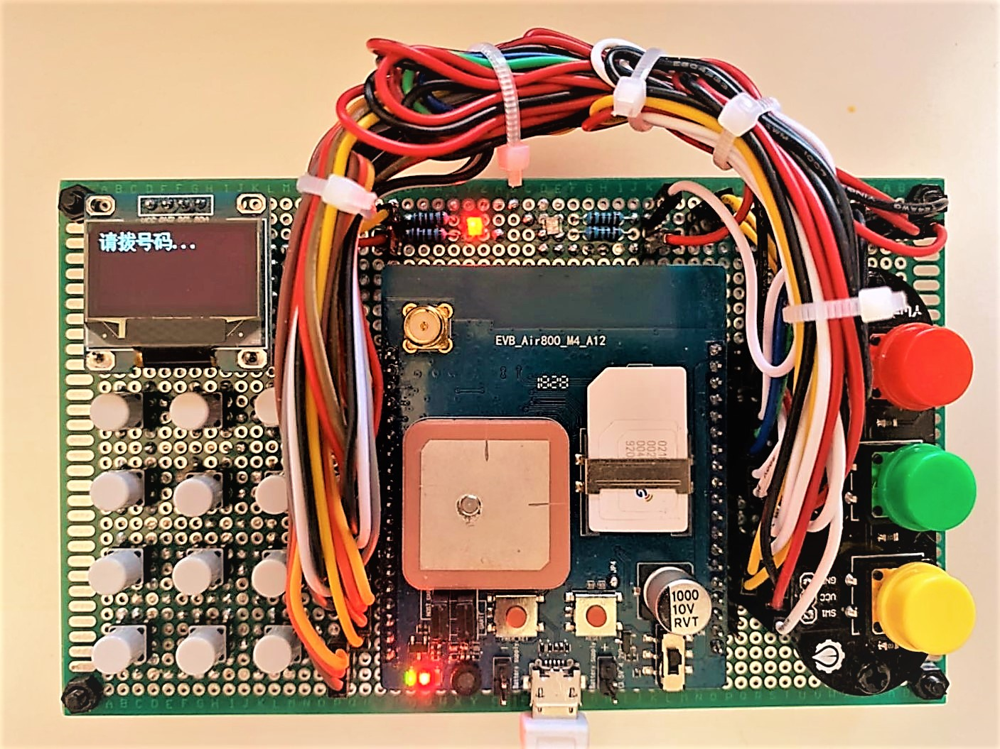
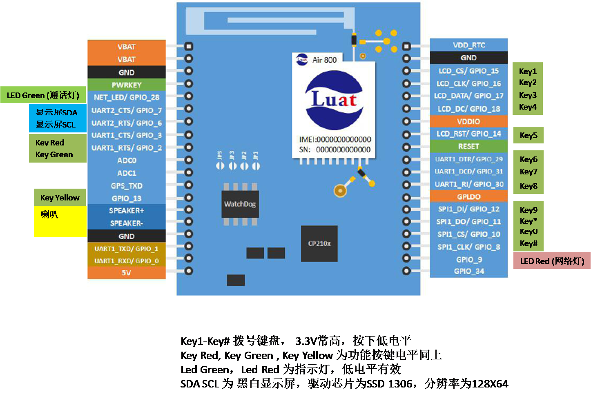

# 基本电话 Ver0.09 #

## 功能： ##

完成传统手机的基本功能，功能如下：

1） 拨打接听电话

2） 收发短信

3） 128X64 黑白屏幕显示

*） 另外提供文字朗读功能

##硬件##
1） 3X4标准电话键盘，每个按键可引发硬件中断

2） 三个通用按键，实现拨打（执行），挂断（停止），功能切换

3） 两个LED指示灯，指示是否联网（红色），是否正在通话（绿色）

4） 一个黑白显示屏，显示控制信息

5） 可以外接电池

硬件电路采用合宙出品的EVB_Air800_M4_A12评估板，电路连接图如下

##软件##

1 拨打电话功能

按下数字键，液晶屏显示响应按键，错误的可以按红色按键删除前一个输入数字

号码输入完毕，按下绿色按键，拨打对方电话

播放提示语音

2 接听电话功能

外部电话接入时，绿色灯闪烁，屏幕提示对方电话号码

按下绿色按键，接听对方号码，并播放提示语音。

3 发送短信

按下数字键，液晶屏显示响应按键，错误的可以按红色按键删除前一个输入数字
号码输入完毕，按下黄色按键，根据屏幕提示，切换到message模式
按下绿色键，发送制定测试文本

4 接收短信

收到外部短信后，屏幕显示收到短信，并显示内容保持3秒钟时间，恢复原界面

5 朗读功能

按下黄色按键，根据屏幕提示切换到Speech模式
按下绿色键，播放一段音乐后，播放提示语音

软件采用微软出品的开源文本编辑环境，Visual studio code

安装插件 Lua Debug 和 Lua and Ravi 5.3 Debugger

脚本烧写工具为Lua_Tools 1.7.0

##代码简介##

本程序基于事件响应逻辑，根据硬件中断引发的相应事件转由软件处理并实现相关的逻辑。 主要处理逻辑均在event模块中完成

事件可以是按钮的点击，收到电话及短消息等，也包括一些状态报告事件，如网络连通，通话接通，挂断。

其他模块均为服务模块，功能为提供事件来源及执行指定的硬件操作

module main

启动模块，导入其他功能模块

module event

功能执行模块，按照事件进行相关的逻辑控制响应

module gpio

负责IO引脚的输入与输出配置和控制

module call

负责电话通讯，包括语音，短信，和TTS服务

module ui

负责用户界面和屏幕显示

module test

负责debug测试

目录中还了包括了项目使用的其他媒体资源文件，一并需要使用Lua_Tools上传到硬件中

##许可协议##

本项目遵守MIT协议